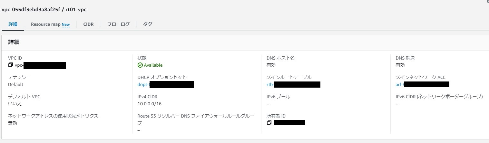
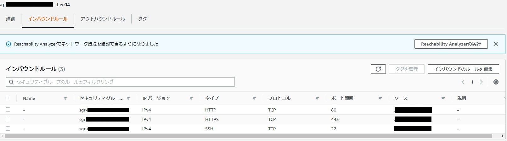
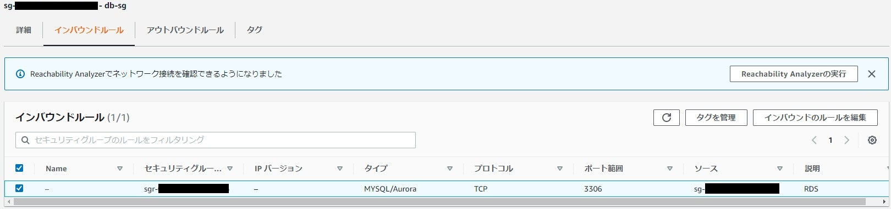
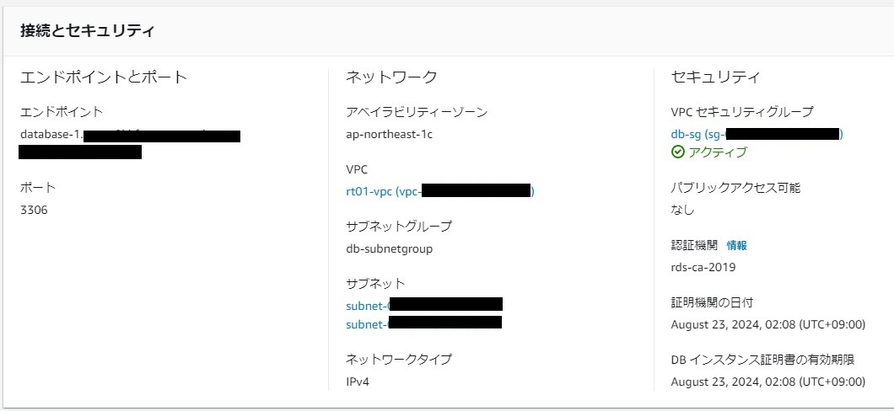
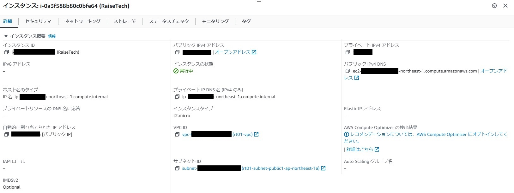
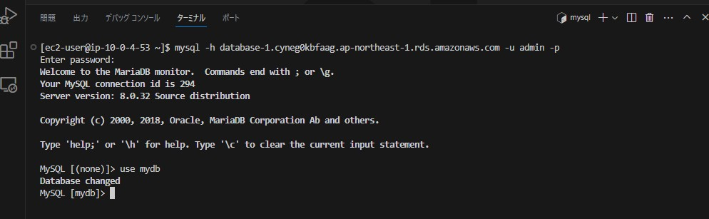

# 第4回課題提出

## ① VPCの作成

- サブネット作成
- セキュリティグループの作成（EC2用とRDS用の2つ）

[EC2用セキュリティグループ]　ソースをローカルのグローバルIPアドレスに設定

[RDS用セキュリティグループ]　ソースをEC2用のセキュリティグループに設定

 

## ② RDSの構築

- サブネットグループの作成 （①で作成したVPCのプライベートサブネットを2つ選択した）
- RDSの作成

    作成したVPCとサブネットグループを選択
    
    セキュリティグループは①で作成したRDS用を選択

 

## ③ EC2インスタンスの構築

- ①で作成したEC2用のセキュリティグループを選択
- キーペアの作成

 

## ④ EC2からRDSへSSH接続

- VSCodeからSSH接続でEC2にログインする
- EC2にmysqlをインストールして、ログインする

## 感想

分からないワードが多かったので、一つ一つ調べながらの作業でかなり時間がかかった。

EC2への接続をCloud9ではなくVSCodeからにしようと思ってからがさらに時間がかかった。~/.sshってどこ？から始まって、configファイル保存できないし、IPアドレス入力したのに接続できないなどつまづきポイントがたくさんあったがなんとかできたと思う。

ElasticIPアドレスが必要という記事が多かったけど、とりあえずは毎回EC2のIPv4アドレスを保存し直すことで対応していく。