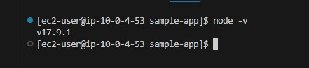
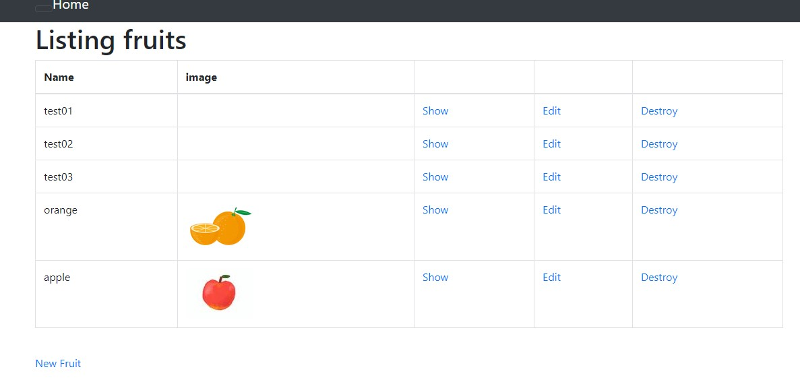

# 第5回課題

- 組み込みサーバーでデプロイする
- Nginx + Unicornでデプロイできるようにする
- ELBを追加する
- S3を追加する
- 構成図の作成
-------

 

# 組み込みサーバーでのデプロイ

## EC2には何もないので必要なものをインストールする

### 1.サーバーのアップデート

    $ sudo yum update -y

 

### 2.各種プラグインのインストール

Git/コンパイル用コマンド/コンパイラ/パッチ適用コマンド/OpenSSL用ファイル/Ruby用パッケージ/アプリ開発用ライブラリ
   
    $ sudo yum install git make gcc-c++ patch openssl-devel libyaml-devel libffi-devel libicu-devel libxml2 libxslt libxml2-devel libxslt-devel zlib-devel readline-devel

 

### 3.Node.jsのインストール

-Node.jsのバージョン管理ツールnvmをインストール

    $ curl -o- https://raw.githubusercontent.com/nvm-sh/nvm/v0.38.0/install.sh | bash

-アプリケーションの動作環境がv17.9.1だから、バージョン指定でNodeをインストール

    $ nvm install v17.9.1

-vimで.bashrcを表示して最終行に2行が追加されていることを確認する

    $ sudo vim ~/.bashrc

export NVM_DIR="$([ -z "${XDG_CONFIG_HOME-}" ] && printf %s "${HOME}/.nvm" || printf %s "${XDG_CONFIG_HOME}/nvm")"
[ -s "$NVM_DIR/nvm.sh" ] && \. "$NVM_DIR/nvm.sh" # This loads nvm

 

### 4.rbenvとruby-buildのインストール（Rubyのバージョン管理ツール）

-Homebrewのインストール

    $ /bin/bash -c "$(curl -fsSL https://raw.githubusercontent.com/Homebrew/install/HEAD/install.sh)"

-インストールしたらPATHを通してあげる

    $ echo 'export PATH=/home/linuxbrew/.linuxbrew/bin:$PATH' >> ~/.bash_profile

    $ source ~/.bash_profile

-brew -v　これ打ってバージョンが表示されたらインストール成功＆PATHが通っている→Homebrew 4.0.19

-rbenvとruby-buildのインストール

    $ brew install rbenv ruby-build

-ターミナル起動時に rbenv が自動的に読み込まれるようにセットアップする

~/.bash_profileの最下段に以下を追記

eval "$(rbenv init - bash)"

-確認する

    $ rbenv -v

    $ruby-build --version

 

### 5.Rubyのインストール

-rbenvでインストールできるRubyのバージョンを確認して、インストールする

    $ rbenv install --list

    $ rbenv install 3.1.2

サンプルアプリケーションのRubyバージョンが表示されなかったけど、バージョン指定でインストールできた（表示されてる最新のより前のは一覧になくてもインストールできるっぽい）

 

-Rubyのバージョンを切り替える（一つしかバージョン入れてないけど、切り替え必要っぽい）

    $ rbenv local 3.1.2

-PATHを通す

    $ sudo vim ~/.bash_profile

PATH=$PATH:$HOME/bin:/home/ec2-user/.rbenv/versions/3.1.2/bin に修正して保存

 

-読み込みをして、ちゃんとインストールされたか確認する

    $ source ~/.bash_profile

    $ ruby --version

 

### 6.bundlerのインストール

-バージョン指定でインストールする

    $ gem install bundler:2.3.14

 

### 7.yarnのインストール

    $ npm install -g yarn

 

### 8.MySQLのクライアントをインストール

bundle installの時にmysql関連でエラーが出たり、mysqlとmysqldコマンドの違いなどがこの時点で分からなかったので、今回はMySQLクライアントをインストールする方法に変更した。

-MariaDBがインストールされているので念のためアンインストールする

    $ yum list installed | grep mariadb

    $ sudo yum remove mariadb-libs

-MySQLをインストールするためのリポジトリを追加

    $sudo yum localinstall https://dev.mysql.com/get/ mysql80-community-release-el7-7.noarch.rpm

-MySQL8.0のリポジトリを有効にし、5.7を一応無効にしておく

    $ sudo yum-config-manager --enable mysql80-community

    $ sudo yum-config-manager --disable mysql57-community

-MySQL8.0のクライアントをインストール

    $ sudo yum install mysql-community-client

-確認

    $ mysql --version

 

### 9.railsのインストール　（bundlerを使ってrailsをインストールする）

-新しくrepository_dirのディレクトリを作成して移動

-サンプルアプリケーションをcloneする

-$ bundle install --path vendor/bundleを実行

-エラーがでたので指示に従って、bundle config set --local path vendor/bundle を実行。（.bundleファイルが自動作成されて、次からは bundle installでできるようになった）

-再度インストールを実行し、確認する

    $ bundle install

    $bundle exec rails -v

 

## RDSに接続する

### database.ymlファイルを変更する

-usernameとpasswordを変更して、host[RDSのエンドポイント]を追加した

-以下のコマンドを実行

    $ bundle exec rails db:create

    $ bundle exec rails db:migrate

-mysqlにログインしてデータベースが作成されていることを確認

## アプリケーションを起動

-ec2のセキュリティグループにポート3000を開放

-bin/devで起動

 

# サーバーアプリケーションを分ける

## Webサーバー　Nginx

### 1.Nginxのインストールとセットアップ

-nginxのyum installを有効にして、yumコマンドでインストール

    $ sudo amazon-linux-extras enable nginx1

    $ sudo yum -y install nginx

-自動起動の設定

    $ sudo systemctl enable nginx

以下が帰ってくればOK

Created symlink from /etc/systemd/system/multi-user.target.wants/nginx.service to /usr/lib/systemd/system/nginx.service.

-nginxを起動する

    $ sudo systemctl start nginx.service

    $ sudo systemctl status nginx.service

-Webサーバーにアクセスしてみる（セキュリティグループにポート80を開放済み）

ブラウザでhttp://[ec2のIPアドレス]でアクセスする

### 2.Nginxの設定ファイルを編集する

-/etc/nginx/conf.d/内にrails.confというファイルを作成、編集する

    $ sudo vim /etc/nginx/conf.d/rails.conf

-server_nameはec2のIPアドレスを記載した

 

## APサーバー　Unicorn

### 1.unicorn.rbファイルを編集する

-listenところのPATHはrails.confファイルのupstreamのserverのPATHと同じになるようにする

 

### 2.unicornの起動・停止をするスクリプトを作成

-unicorn.rakeファイルを作成

    $ bundle exec rails g task unicorn

-unicorn_pidのところのPATHを修正した

 

## Nginx + Unicorn で起動させる

-unicornを起動

    $ bundle exec rails unicorn:start

-nginxは設定を反映させるために一度停止してからもう一度起動させた

-ブラウザでhttp://[IPアドレス]でアクセスする

-画像が表示されないので、imagemagickをyumでインストールした（brewではできなかった）

    $ sudo yum -y install ImageMagick

    $ convert -version

-再度ブラウザからアクセスする

 

# ELB(ALB)を追加する

### 1.ELBを作成する

-ALBを選択

-VPCをEC2と同じものを選択

-セキュリティグループを新たに作成(elb-sg)

-インバウンドルールにHTTP ポート80を追加

-ターゲットグループを作成し、EC2を登録する

-EC2のセキュリティグループのインバウンドルールを変更

（vscodeの接続のためのSSHだけ残して他は削除、ELB用のセキュリティグループが接続できるようにルールを追加）

HTTP ポート：80 ソース：ELBのセキュリティグループ

 

### 2.ELBのDNS nameでブラウザからアクセスする

Blocked hostとエラーがでたので、アプリケーションのconfig/enviroments/development.rbにエラー画面にあったホスト名を追加した

-nginxとunicornを再起動させて、再度ELBのDNS nameでアクセスした

 

# S3を追加する

### 1.S3のバケットを作成

### 2.IAM Policyの作成

- 作成した S3 Bucket にだけアクセスが出来る IAM Policy を作成

- ListBucket/GetObject/PutObject/DeleteObject

- bucket：Bucket名を追加

- object：BucketとObjectの名前を指定　ObjectはAny

 

### 3.S3用のIAMユーザーを作成（EC2からS3へのアクセス制御を行う）

-ポリシーを直接アタッチする　

-アクセスキーIDとシークレットアクセスキー作成する

 

### 3.AWS CLIを使ってEC2からS3へファイルを送信

-アクセスキーとシークレットアクセスキーを登録

    $ aws configure

-確認（S3用に作成したIAMユーザーで実行している）

    $ aws sts get-caller-identity

#テストファイルを作成してS3にアップロードした

    $ aws s3 mv [ファイル名] s3://[Bucket名]/

 

# 構成図の作成

-draw.ioで作成した

 

# 感想

niginxとunicornの設定ファイルを編集するのに時間がかかった。

ディレクトリの階層などを理解していなかったので、中々正しいPATHにたどり着けなった。

どこに何のディレクトリやファイルがあるのかはlsコマンドなどでちゃんと確認するようにする。
