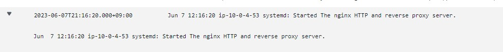

# 第6回課題の提出

- CloudTrailのイベント履歴から3つピックアップ
- CloudWatchアラームの設定
- AWS pricing calculatorを使用しての見積もり
- 5月分のEC2の請求金額を把握
- 課題以外の検証（記録用）

----
## CloudTrailのイベント履歴から3つピックアップ

### イベント履歴から分かること

- ユーザー名：のAWSアカウントのどのユーザが行った作業か
- イベント名：対象サービスで行った操作
- イベントソース：利用したサービス
- 発信元のIPアドレス：リクエストを行ったIPアドレス
- イベント時間

1. アラームの作成

     

2. AWS SNSでtopicの作成

     

3. EC2にIAMロールを割り当て

     

 

## CloudWatchアラームの設定

1. アラームの作成

     メトリクス：UnHealthyHostCount

     アラーム状態トリガー：アラーム状態

     条件：
     
     - ヘルスチェックがunhealthyになったEC2が１つ以上ある状態をアラーム状態として設定

     - アラーム状態になったらAWS SNSを介してメール通知がくるように設定
     - 欠落データの処理を「欠落データのを不正（閾値を超えている）として処理」にしているのでEC2を停止したときもメールがくる

2. 検証：Nginxを停止してブラウザからアクセスする

     エラー502が表示される

     ALBのターゲットグループがUnhealthyになってメール通知がきた

     

3. OKアクションのアラームの作成

     nhealthyがHealthyに復旧したらメール通知がくるよに設定する

     メトリクス：UnHealthyHostCount

     アラーム状態トリガー：OK

4. 検証：Nginxを再起動してブラウザからアクセスする

     ALBのターゲットグループがHealthyになってメール通知がきた

     

 

## AWS pricing calculatorを使用しての見積もり

共有：https://calculator.aws/#/estimate?id=ca2222bde791f371693cf4ebeae9ddb26ec10f47

 

## 5月分のEC2の請求額を把握

- EC2は**USD 0.45**

- 前に数日Elastic IPアドレスを使用したからだと思われる

    

 

----

# 課題以外の検証(記録用)

## CloudTrailのログをCloudWatch Logsに連携してみる

1. CloudTrailで作成した証跡にCloudWatch Logsを設定する

     - 以下設定であることを確認して [次へ] をクリックする。

       新規または既存のロググループ：CloudTrail/DefaultLogGroup

     - CloudTrailがCloudWatch Logsへアクセスする許可が求められるので、[許可] をクリックする。

        （→CloudTrailに対してCloudWatch Logsへのアクセスを許可するサービスロールを割り当てている）

     - IAMロールが作成される　ロール名：CloudTrailroleforLogs

   

2. CloudWatch Logsの保存期間を設定する

   - デフォルトでは、ログが無制限で保存される。ログの保存にもコストがかかるので、ログの保持期間を設定しておく。→1週間に設定

   - CloudWatchのダッシュボードから対象のロググループを選択。(CloudTrailで設定したロググループが追加されている）

   - ロググループのアクションメニューから[保持設定を編集]を選択

   

 

## CloudWatch Logs で AWS EC2 インスタンスのログを管理してみる

1. IAMロールの作成

   - ユースケース：EC2

   - ポリシー：「CloudWatchLogsFullAccess」のポリシー

   - ロール名：EC2roleforCloudWatchLogs

2. EC2にロールを割り当てる

    インスタンスのページでアクション→セキュリティ→IAMロールを変更

    

3. CloudWatch Logsエージェントのインストール

       $ sudo yum install -y awslogs

    

4. CloudWatch Logsエージェントの設定

- /etc/awslogs　内のawscli.confファイルがエージェントのコンフィグファイルだから編集する

     デフォルトはバージニアリージョン(us-east-1)となっているためap-northeast-1に変更

      $ cd /etc/awslogs

      $ sudo vim awscli.conf

   

- ログの出力設定を行う

  /etc/awslogs内のawslogs.conf ファイルを編集する

      $ sudo vim awslogs.conf

   下の方に[/var/log/messages]がある。基本デフォルトのままでlog_group_nameだけ変更した

  （CloudWatch Logs上にロググループとして表示される名前）

  

5. CloudWatch Logsエージェントの開始

       $ sudo systemctl start awslogsd

6. CloudWatch Logsへの出力を確認

- ログストリームはインスタンスid

- 保持期間は1週間に変更した

  

---
## 感想
コスト管理についてはEC2を増やしたらコスト配分タグを有効にして管理してみる。

色々とログを取れるようにしてみたが、いまいちログの見方がつかめない。

なるべくログを確認するようにして慣れていく。